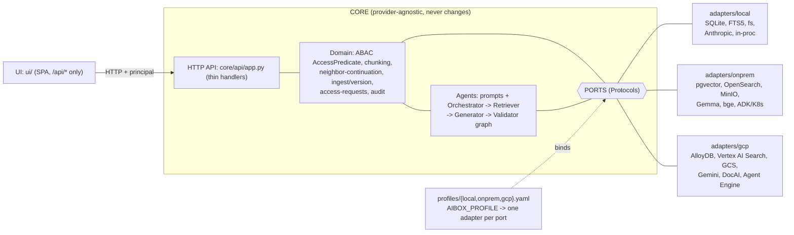

# gcp-unlock

A portable enterprise Gen AI document assistant: **upload, ABAC access-aware hybrid search,
RAG chat with citations, access-request approval, and audit**. One codebase, two production
targets: **GCP-managed** (lowest operational surface) or **no-lock-in Kubernetes** (no vendor
dependency). The same domain logic, agent prompts, and HTTP API serve all three profiles;
only the adapters change.

## What it is

| Capability | Detail |
|---|---|
| Upload + ingest | Parse, page, chunk, embed, index. Documents are private to the uploader by default. |
| Access-aware search | Hybrid retrieval (lexical + vector). ABAC is **pushed into the query**, never post-filtered. |
| RAG chat with citations | Orchestrator -> Retriever -> Generator -> Validator. Every claim cites a numbered excerpt. |
| Groundedness gate | The Validator is a real step: it strips unsupported citations and refuses ungrounded answers before they return. |
| Access-request approval | Restricted documents surface as redacted cards; users request access, owners/approvers grant it. |
| Audit | Every retrieval, grant, and decision is logged. |

Deployable two ways from one codebase:

| Target | Posture | Why |
|---|---|---|
| **GCP** | Managed-first | Vertex AI Search + Document AI fold embedding and reranking into one managed service. Smallest ops surface. |
| **on-prem / K8s** | No lock-in | OpenSearch + pgvector + bge-reranker on Kubernetes. Portable, but depends on hosted inference endpoints (see below). |

## Ports-and-adapters principle

One CORE, swappable adapters, one switch.

- The CORE depends **only on port `Protocol`s** (`core/ports/`). No module under `core/` imports a
  vendor SDK (`google.cloud.*`, `vertexai`, `adk`, `opensearchpy`, `minio`, `presidio`, `anthropic`).
- Adapters implement the ports. A **profile** binds exactly one adapter per port via the static
  `REGISTRY` in `core/container.py` (an allowlist; YAML profiles pick a key, they cannot import
  arbitrary code).
- One environment variable selects everything:

```
AIBOX_PROFILE = local | onprem | gcp
```

| Port | local | onprem | gcp |
|---|---|---|---|
| llm | Anthropic | Gemma (LiteLLM) | Vertex Gemini |
| embedder | noop / extractive | hosted endpoint | Vertex |
| reranker | noop | bge (hosted) | Vertex (folded in) |
| object_store | filesystem | MinIO | GCS |
| relational | SQLite | PostgreSQL + pgvector | AlloyDB |
| retriever | FTS5 | OpenSearch (BM25 + kNN) | Vertex AI Search |
| parser | pypdf | Tika | Document AI |
| guardrail | noop | Llama Guard / NeMo | Model Armor |
| dlp | noop | Presidio | Cloud DLP |
| identity | dev header | OIDC | Apigee |
| orchestrator | in-process loop | ADK on K8s | Vertex Agent Engine + ADK |

**Agent layer.** ADK is the agent runtime in both production targets (GCP: Vertex AI Agent Engine
+ ADK; on-prem: ADK on K8s). The agent **prompts** and the Orchestrator -> Retriever -> Generator
-> Validator **graph** live in `core/agents/` and are reused by every runtime. Only the model
binding (Gemini vs Gemma via LiteLLM) and the host differ. Local dev runs a lightweight in-process
runner of the **same** prompts.

**Retrieval.**
- GCP: Vertex AI Search + Document AI for best quality. AlloyDB holds the canonical chunk **text** +
  ABAC side-tables and is the source of truth for neighbor-continuation and citation -> source highlight.
- on-prem: OpenSearch (BM25 + kNN) + bge-reranker; PostgreSQL + pgvector holds chunk text + ABAC.

**ABAC.** ABAC is a CORE-owned model (`AccessPredicate`) compiled per backend: a shared SQL compiler
for SQLite/pgvector/AlloyDB, a filter-DSL compiler for Vertex, and a DLS compiler for OpenSearch. The
**policy model + orchestration is reused**; the **enforcement mechanism is per-adapter**. It is not
verbatim-identical SQL across targets.

**Embedder and Reranker are first-class ports.** Consequence, stated plainly: the on-prem profile
depends on **four external hosted inference endpoints** (LLM/Gemma, embedder, reranker/bge,
safety/Llama Guard). There is **no on-prem GPU**. GCP folds embedding and reranking into managed
Vertex AI Search, which is the core of the GCP operational-surface argument.

### The hexagon



## Repo layout

```
core/        provider-agnostic domain, agents, api, ports, schema
  ports/       port Protocols (__init__.py) + neutral types (types.py)
  agents/      shared prompts + the Orchestrator->Retriever->Generator->Validator graph
  schema/      canonical, dialect-neutral reference schema (schema.sql)
  api/         FastAPI app factory (create_app)
  container.py composition root: static REGISTRY allowlist, one adapter per port
adapters/
  local/       SQLite, FTS5, filesystem, Anthropic, in-process orchestrator
  gcp/         AlloyDB, Vertex AI Search, GCS, Gemini, Document AI, Agent Engine
  onprem/      pgvector, OpenSearch, MinIO, Gemma, bge, ADK-on-K8s
profiles/      local.yaml | onprem.yaml | gcp.yaml (bind adapters per port)
deploy/        K8s manifests + docker-compose for the onprem profile
infra/         settings/profile loader (infra/settings.py), env interpolation
ui/            single-page UI
eval/          groundedness / retrieval eval harness
tests/         core + adapter tests
docs/          ARCHITECTURE.md, comparison/gcp-vs-onprem.md
```

## Quick start (local profile)

Runs end-to-end now, on a laptop, no cloud account.

```
pip install -r requirements.txt
AIBOX_PROFILE=local uvicorn core.api.app:create_app --factory --reload
```

Serves http://127.0.0.1:8000.

- Set `ANTHROPIC_API_KEY` for LLM-generated answers; without it the local profile falls back to an
  **extractive** answer (citations from retrieved excerpts, no generation).
- `local` uses SQLite + FTS5 + the filesystem + an in-process runner of the shared agent prompts.

## on-prem profile

```
AIBOX_PROFILE=onprem  # stand up the stack via deploy/k8s/docker-compose.onprem.yml
```

Brings up PostgreSQL + pgvector, OpenSearch, and MinIO. It needs **hosted inference endpoints**
for the LLM (Gemma), embedder, reranker (bge), and safety (Llama Guard) configured in the profile.
**No on-prem GPU**: all four model calls go out to hosted endpoints.

## gcp profile

`AIBOX_PROFILE=gcp` binds the Vertex / AlloyDB / GCS / Document AI / Agent Engine adapters. These are
real code and require a configured GCP project. Vertex AI Search folds embedding and reranking into
one managed service, removing two of the four inference endpoints the on-prem profile must host.

## Current state (honest scaffold reality)

- The prototype **AI Box** is SQLite + local filesystem + Anthropic API today. This ports-and-adapters
  refactor is the shared **Year-0 build**, costed **once** and common to both targets.
- **local** profile: runs end-to-end now.
- **onprem** profile: code-complete (docker-compose).
- **gcp** adapters: real code, require a GCP project.

## Security invariant

**ABAC is enforced server-side on every retrieval.** The `AccessPredicate` is composed in CORE and
compiled into the backend's native filter (SQL `WHERE` fragment, Vertex filter-DSL, or OpenSearch DLS)
and pushed **into** the query. Access is never post-filtered, never decided by the model, and never
enforced in the UI. Restricted documents are returned as server-side redacted cards. Secrets stay in
the environment (profiles reference them via `*_env` indirection; YAML never holds a secret).

## More

- Architecture deep-dive: [docs/ARCHITECTURE.md](docs/ARCHITECTURE.md)
- GCP vs on-prem comparison: [docs/comparison/gcp-vs-onprem.md](docs/comparison/gcp-vs-onprem.md)

Render the comparison as a slide deck:

```
npx @marp-team/marp-cli docs/comparison/gcp-vs-onprem.md -o deck.pptx
```
