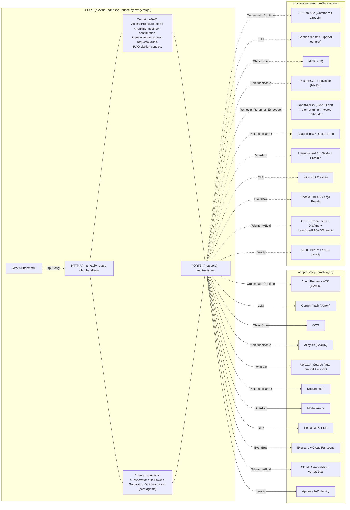

# gcp-unlock: Architecture and Project Plan

Provider-agnostic enterprise Gen AI Assistant (agentic RAG over access-controlled documents) that
deploys two ways from one codebase: a GCP-managed target and a no-lock-in Kubernetes target. The repo
is a ports-and-adapters refactor of the AI Box prototype, designed so the domain core, the agent
prompts and graph, the HTTP API, and the SPA are written once and reused by every target. Only the
provider edges (adapters), the per-target config (profiles), and the IaC (deploy) change.

## 1. Overview and the hexagonal principle

### Goal

| Property | Statement |
|---|---|
| One core | Domain logic, the agent prompts + Orchestrator->Retriever->Generator->Validator graph, the HTTP API, and the SPA are written once and reused across targets. |
| Swappable adapters | Every provider edge (LLM, embedder, reranker, retrieval, storage, parsing, safety, DLP, eventing, telemetry, identity, agent runtime) sits behind a CORE-owned port. |
| One switch | `AIBOX_PROFILE=gcp|onprem|local` binds the entire adapter set via a static registry. No code change to retarget. |
| Honest comparison | GCP advantages are concrete (managed retrieval quality, fewer inference endpoints to operate, speed-to-market). On-prem is a credible, fully swappable alternative. |
| Inference is external in BOTH | No model, reranker, embedder, or safety classifier runs on customer GPUs in either target. Both call hosted endpoints. |

### Design principle: ports and adapters (hexagonal)

- CORE depends only on **port Protocols** (`core/ports/__init__.py`) and **neutral dataclasses**
  (`core/ports/types.py`). No module under `core/` imports `google.cloud.*`, `vertexai`, ADK,
  `opensearchpy`, `minio`, `presidio`, or `anthropic`.
- ABAC is a **CORE-owned policy model** (`AccessPredicate`), built once per principal and **compiled
  per backend** by an `AclCompiler`. The policy model and orchestration are reused; the enforcement
  mechanism is per-adapter. There is no claim of "verbatim identical SQL" across targets.
- The agent **prompts and the Orchestrator->Retriever->Generator->Validator graph live in CORE**
  (`core/agents/prompts.py`) and are reused by every runtime. Only the model binding (Gemini vs Gemma
  via LiteLLM) and the host (Vertex AI Agent Engine vs ADK-on-K8s vs in-process) differ.
- A **Validator / groundedness gate is a real step** before any answer is returned.
- Adapters are thin: most are SDK glue mapping a neutral request/result to a vendor API.
- A single **composition root** (`core/container.py`) reads the active profile and injects concrete
  adapters into the FastAPI app.

### Hexagonal diagram



### Invariants that survive both targets

| Invariant | Enforcement |
|---|---|
| ABAC is server-side, on every retrieval | CORE builds `AccessPredicate`; each backend's `AclCompiler` pushes it INTO the query (SQL WHERE fragment / Vertex filter-DSL / OpenSearch DLS). ACL attributes are **denormalized onto each chunk at index time** so the predicate is pushed down, never post-filtered. Never filtered in the UI. |
| Default owner-only | New document is private to its uploader until shared to groups. CORE policy. |
| Restricted cards | Server-side redaction. The restricted set is computed by `Retriever.search_inaccessible` (a first-class port method), never CSS-blur of plaintext. |
| Stable chunk identity | `chunk_id` is a stable, fetchable string (uuid in the canonical schema), not an autoincrement int. Citations and citation->source highlight round-trip through `RelationalStore.get_chunks`. |
| Source of truth for text | `RelationalStore` holds the canonical chunk TEXT and serves neighbor continuation via `RelationalStore.neighbors`. The Retriever is ranking-only (it may own opaque segment ids). |
| Groundedness gate | The Validator step strips uncited `[n]` references and can mark an answer ungrounded before return. |
| Single trust path | With the Identity port active, dev `X-User` and self-issued JWT are profile-gated OFF in `gcp`/`onprem`. CORE trusts only the gateway-attested identity there. |

### What is NOT portable (stated plainly, not implied)

- **Ranking is not portable.** BM25, the lexical title-boost, the stopword list, RRF, and the
  reranker are CORE-resident retrieval behaviors only in the `local` adapter; they do not survive a
  backend swap. GCP folds embedding + reranking into Vertex AI Search; on-prem uses OpenSearch +
  bge-reranker. There is no ranking parity claim.
- **`status='published'` and any title-boost re-rank** are retrieval behaviors of the active retriever
  adapter, not a guaranteed cross-backend behavior.
- **Chunk boundaries (and therefore citation spans, section labels, the restricted-card head)** differ
  by target when Document AI emits native layout chunks vs CORE's `chunk_pages`. Accepted, documented.
- **Eval scores are backend-relative.** The EvalPort normalizes metric names and ranges, not absolute
  values (a Vertex autorater faithfulness is not numerically comparable to a RAGAS faithfulness).
- **On-prem depends on FOUR external hosted inference endpoints** (LLM/Gemma, embedder, reranker/bge,
  safety/Llama Guard), whereas GCP folds embedding + reranking into managed Vertex AI Search and safety
  into Model Armor. This is a real operational-surface difference, not a footnote.

## 2. Ports catalog (final signatures)

All ports live in `core/ports/__init__.py`; neutral types in `core/ports/types.py`. CORE imports only
these. Selection is by one profile var resolved through the static `REGISTRY` in `core/container.py`.

### 2.0 ABAC compiler (the crown jewel, corrected)

CORE owns the policy MODEL; each backend compiles it. There is no single SQL string shared across
targets.

```python
@dataclass
class AccessPredicate:
    # core/ports/types.py -- built once by core.domain.abac.build_predicate(principal)
    user_id: str; is_admin: bool; clearance: int
    groups: list[str]; user_type: str; projects: list[str]; now: float

class AclCompiler(Protocol):
    def to_sql(self, pred: AccessPredicate, table_alias: str = "d") -> tuple[str, list[Any]]: ...
    def to_filter(self, pred: AccessPredicate) -> Any: ...   # Vertex filter-DSL / OpenSearch DLS
```

- SQL compiler is shared by `sqlite` / `pgvector` / `alloydb` (Postgres-family WHERE fragment + params).
- `to_filter` produces a Vertex filter expression or an OpenSearch bool-filter / DLS clause.
- ACL attributes are **denormalized onto each chunk row** (`chunks.owner_id`, `min_clearance`,
  `departments`, `user_types`, `projects` in `core/schema/schema.sql`) so the predicate is pushed into
  the retriever index, not applied after retrieval.

### 2.1 LLM, Embedder, Reranker

```python
class LLM(Protocol):
    def generate(self, *, system: str, messages: list[dict],
                 context_blocks: Sequence[Chunk] | None = None,
                 tools: list[dict] | None = None, tool_choice: str | None = None,
                 response_schema: dict | None = None, max_tokens: int = 2048,
                 temperature: float = 0.2, metadata: dict | None = None) -> LlmResult: ...
    def stream(self, **kw: Any) -> Iterator[str]: ...
    def capabilities(self) -> ModelCapabilities: ...

class Embedder(Protocol):
    def embed(self, texts: Sequence[str], *, kind: str = "document") -> list[list[float]]: ...
    def dim(self) -> int: ...

class Reranker(Protocol):
    def rerank(self, query: str, hits: Sequence[Hit], top_k: int) -> list[Hit]: ...
```

- `ModelCapabilities` (`max_context_tokens`, `supports_tools`, `supports_parallel_tools`,
  `strict_json`, `supports_streaming`) lets CORE tune retriever `k` and history depth per profile and
  keep a validate-and-repair fallback when `strict_json` is false.
- GCP: Gemini Flash via Vertex `generateContent`; embedding + reranking folded into Vertex AI Search,
  so `Embedder`/`Reranker` are no-ops there. On-prem: Gemma via OpenAI-compatible endpoint (LiteLLM),
  a **hosted** embedder, and a **hosted** bge-reranker (two of the four on-prem inference endpoints).

### 2.2 ObjectStore

```python
class ObjectStore(Protocol):
    def put(self, key: str, data: bytes, content_type: str, metadata: dict | None = None) -> ObjectRef: ...
    def get(self, key: str, version_id: str | None = None) -> bytes: ...
    def signed_url(self, key: str, *, method: str = "GET", version_id: str | None = None,
                   ttl_s: int = 300, content_disposition: str | None = None) -> str | None: ...
    def supports_signed_urls(self) -> bool: ...
    def head(self, key: str, version_id: str | None = None) -> ObjectRef | None: ...
    def list_versions(self, key: str) -> list[ObjectRef]: ...
    def delete(self, key: str, version_id: str | None = None) -> None: ...
```

- One S3-compatible client serves both GCS (XML/HMAC) and MinIO; the native `google-cloud-storage`
  SDK is used only where S3 leaks (V4 signed URL with `response-content-disposition`, generation
  versioning, CMEK). `version_id` is an opaque token CORE never parses.
- `supports_signed_urls()` is an explicit capability (no magic sentinel). When false, CORE proxies
  bytes. Signed URLs are issued only after the ABAC check passes; TTLs are short.

### 2.3 RelationalStore (source of truth for chunk text + ABAC side-tables)

```python
class RelationalStore(Protocol):
    def execute(self, sql: str, params: Sequence[Any] = ()) -> list[dict]: ...
    def executemany(self, sql: str, rows: Sequence[Sequence[Any]]) -> None: ...
    def begin(self) -> "RelationalStore": ...   # context manager; commit on exit
    def migrate(self) -> None: ...              # adapter owns dialect-specific DDL
    def get_chunks(self, chunk_ids: Sequence[str]) -> list[Chunk]: ...
    def neighbors(self, doc_id: str, chunk_seq: int, radius: int = 1) -> list[Chunk]: ...
```

- CORE composes the ABAC predicate (via `AclCompiler.to_sql`) and passes the SQL fragment in; the store
  just runs it.
- `get_chunks` (citation->source highlight) and `neighbors` (+/-1 continuation) make
  `RelationalStore` the source of truth for chunk text, so continuation and citations work even when
  the retriever owns opaque segment ids.
- `migrate()` is adapter-owned: `core/schema/schema.sql` is the dialect-neutral REFERENCE for the table
  set; each adapter materializes it in its dialect (SQLite FTS5; pgvector `USING hnsw` + tsvector GIN;
  AlloyDB `USING scann`). There is no single schema.sql run verbatim on every backend.

### 2.4 Retriever (ranking only)

```python
class Retriever(Protocol):
    def index(self, doc_id: str, chunks: Sequence[Chunk], acl_attrs: dict) -> int: ...
    def search(self, *, query: str, pred: AccessPredicate,
               doc_ids: Sequence[str] | None = None, k: int = 8,
               filters: dict | None = None) -> list[Hit]: ...
    def search_inaccessible(self, *, query: str, pred: AccessPredicate, k: int = 12) -> list[str]: ...
    def delete_doc(self, doc_id: str) -> None: ...
```

- `search` takes the `AccessPredicate` and pushes it INTO the backend query (compiled via the
  retriever's `AclCompiler.to_filter`), never post-filtering.
- `Hit.score` is **normalized 0..1, higher = better**, so CORE sorts the same way regardless of backend
  (BM25 vs RRF vs cosine).
- `search_inaccessible` returns the doc ids the user CANNOT access, for restricted-card rendering. The
  redaction text comes from the canonical store, not from the UI.
- GCP: Vertex AI Search (auto-chunk, auto-embed, RRF + managed reranker). On-prem: OpenSearch hybrid
  (BM25 + kNN, RRF pipeline) then the hosted bge-reranker.

### 2.5 DocumentParser

```python
class DocumentParser(Protocol):
    def supported_types(self) -> set[str]: ...
    def read_pages(self, data: bytes, filename: str) -> list[Page]: ...
    def native_chunks(self, pages: list[Page]) -> list[Chunk] | None: ...  # None -> CORE chunk_pages
```

- GCP: Document AI Layout Parser (tables, reading order, OCR) MAY return native layout-aware chunks
  (bypasses CORE `chunk_pages`). On-prem: Tika / Unstructured (+ OCR fallback) returns `None` so CORE's
  heading-anchored `chunk_pages` runs. Chunk boundaries (and citation spans) are not byte-identical
  across targets; accepted leak.

### 2.6 Guardrail (safety: injection, content, sanitize)

```python
class Guardrail(Protocol):
    def check_input(self, text: str, ctx: GuardContext) -> Verdict: ...
    def check_context(self, blocks: Sequence[Chunk], ctx: GuardContext) -> Verdict: ...
    def check_output(self, text: str, ctx: GuardContext) -> Verdict: ...
```

- CORE seam in the chat turn: `check_input(q)` pre-retrieval, optional `check_context(blocks)`,
  generate, then `check_output(answer)` before persist/return. On BLOCK: safe refusal + audit.
- GCP: Model Armor (one hop: injection + RAI filters + DLP-deidentify). On-prem: composite
  (Llama Guard 4 hosted + NeMo Colang rails + Presidio); any BLOCK wins, Presidio drives REDACT.
- Note: Guardrail is **safety**, distinct from the Validator (groundedness), which lives in the agent
  graph, not here.

### 2.7 DLP (PII inspect + de-identify)

```python
class DLP(Protocol):
    def inspect(self, text: str, info_types: list[str] | None = None,
                min_likelihood: str = "POSSIBLE") -> list[Finding]: ...
    def deidentify(self, text: str, transforms: dict[str, str] | None = None) -> Deid: ...
    def reidentify(self, text: str, token_map: dict) -> str: ...
```

- Three CORE seams: at ingest (before chunk insert), pre-LLM context assembly, and on the model answer.
  Stage policy lives in the profile.
- GCP: Cloud DLP / SDP (150+ infoTypes, KMS-keyed FPE). On-prem: Presidio. Canonical info-type enum
  with per-adapter mapping; `likelihood` enum vs Presidio float bucketed in the adapter. `reidentify`
  is provider-specific; persisted tokens are not portable.

### 2.8 EventBus (async ingest)

```python
class EventBus(Protocol):
    def publish(self, event: DocumentUploaded) -> None: ...
    def subscribe(self, handler: Callable[[DocumentUploaded], IngestResult]) -> None: ...
```

- CORE worker entrypoint stays provider-agnostic: `handle_document_uploaded(event) -> IngestResult`
  (parse -> chunk -> embed -> index). Idempotency key = `(tenant_id, object_uri, sha256)`, enforced
  before index.
- GCP: Eventarc (GCS object-finalize) + 2nd-gen Cloud Function. On-prem: MinIO notify -> Kafka/NATS ->
  Knative/KEDA/Argo. Local: inline synchronous dispatch. Only the ~30-line event mapper and manifests
  differ.

### 2.9 Telemetry + Eval

```python
class Telemetry(Protocol):
    def log(self, event: str, attrs: dict, severity: str = "INFO") -> None: ...
    def span(self, name: str, attrs: dict) -> Any: ...   # context manager
    def metric(self, name: str, value: float, kind: str = "counter", tags: dict | None = None) -> None: ...

class Eval(Protocol):
    def score_turn(self, turn: RagTurn) -> dict[str, float]: ...
    def sample_online(self, turn: RagTurn, rate: float) -> None: ...
```

- The append-only `audit()` becomes one adapter behind `Telemetry.log`. CORE wraps retrieval,
  continuation, generation, and the agent turn in spans/metrics; OpenTelemetry is the portable seam.
- `RagTurn` carries `retrieved`, `context_blocks`, `answer`, `citations`, `grounded`, `tool_calls`,
  `latency_ms`, so the Validator verdict and tool-use feed eval. GCP: Cloud Observability + Vertex Gen
  AI Eval (managed autorater) + ADK auto-spans. On-prem: OTel -> Prometheus/Tempo/Loki/Grafana +
  Langfuse + RAGAS + Phoenix (judge via hosted Gemma/Gemini). Absolute scores are backend-relative.

### 2.10 Identity (gateway contract)

```python
class Identity(Protocol):
    def principal_from_request(self, headers: dict) -> Principal | None: ...
```

- The gateway is infra, not a CORE dependency. CORE does authz (ABAC); the gateway attests WHO.
- GCP: Apigee/IAP verifies OIDC, mints a signed internal identity header over mTLS. On-prem: Kong/Envoy
  + OIDC (Keycloak/Dex), strips client-supplied headers, injects a trusted one. In `gcp`/`onprem`, the
  dev `X-User` path and self-issued JWT acceptance are **profile-gated off** so there is a single trust
  path. Local: `DevIdentity` (dev JWT / `X-User`) for laptop use only.

### 2.11 Notifier

```python
class Notifier(Protocol):
    def notify(self, to: str, subject: str, body: str) -> None: ...
```

- GCP: Pub/Sub + SendGrid. On-prem: SMTP relay. Local: in-memory outbox.

### 2.12 OrchestratorRuntime (the agent layer, ADK in both targets)

```python
class OrchestratorRuntime(Protocol):
    def run_turn(self, *, principal: Principal, query: str, history: list[dict],
                 doc_ids: Sequence[str] | None) -> AgentResult: ...
```

- Hosts the **Orchestrator -> Retriever -> Generator -> Validator** graph. The PROMPTS and the loop
  contract live in `core/agents/prompts.py` (`SYSTEM_PROMPT`, `ORCHESTRATOR_INSTRUCTION`,
  `RETRIEVER_INSTRUCTION`, `GENERATOR_INSTRUCTION`, `VALIDATOR_INSTRUCTION`, `RETRIEVE_TOOL`) and are
  reused verbatim by every runtime. Retrieval is injected as a CORE tool (ABAC enforced server-side),
  never delegated to the model.
- `AgentResult` is `{answer, cites, chunks_used, docs, grounded, trace_id, usage}`, identical on every
  runtime.
- GCP: ADK app on Vertex AI Agent Engine (Gemini), managed sessions/memory/tracing. On-prem: the
  byte-for-byte same ADK app on K8s, model bound to Gemma via `LiteLlm(...)`, sessions on Postgres,
  traces to Langfuse/Phoenix. Local: `SimpleOrchestrator`, an in-process runner of the same prompts and
  the same four-step graph.

## 3. File-change separation (master table)

Legend: **CORE** never changes between targets. **ADAPTER-gcp / ADAPTER-onprem** are provider-coupled,
one set selected per target. **CONFIG/INFRA** is wiring, env, IaC.

| Capability / function group | CORE | ADAPTER-gcp | ADAPTER-onprem | CONFIG/INFRA |
|---|---|---|---|---|
| ABAC policy model (`AccessPredicate`, `build_predicate`, clearance/user-type vocab) | yes (`core/domain/abac.py`) | -- | -- | -- |
| ABAC enforcement (`AclCompiler`) | model + SQL compiler shared | Vertex filter-DSL compiler | OpenSearch DLS compiler | -- |
| Chunking (`chunk_pages`, heading regex) | yes (`core/domain/chunking.py`) | may bypass via Document AI native chunks | reuses CORE chunking | -- |
| Neighbor continuation (`neighbors`, +/-1) | yes (reads via RelationalStore) | -- | -- | -- |
| Stable chunk id + canonical text | yes (schema + `get_chunks`) | -- | -- | -- |
| Ingest/version orchestration, `handle_document_uploaded` | yes (`core/domain/ingest.py`) | -- | -- | -- |
| Auth crypto (`hash/verify_password`, JWT, request-token HMAC) | yes (`core/domain/auth.py`) | -- | -- | -- |
| Access-request workflow | yes (`core/domain/access_requests.py`) | -- | -- | -- |
| Audit semantics + call sites | yes (`core/domain/audit.py`, emits to Telemetry) | -- | -- | -- |
| Agent prompts + Orchestrator/Retriever/Generator/Validator graph | yes (`core/agents/`) | -- | -- | -- |
| RAG citation contract (`[n]` extraction, citation objects) | yes (`core/domain/rag.py`) | -- | -- | -- |
| ALL `@app.*` routes (auth, me, documents, search, access-requests, conversations, admin, audit) | yes (`core/api/`) | -- | -- | -- |
| Response shaping (`_file_response`, media, Content-Disposition) | yes (bytes from ObjectStore) | -- | -- | -- |
| SPA | yes (`ui/index.html`) | -- | -- | -- |
| Reference schema text | yes (`core/schema/schema.sql`) | -- | -- | -- |
| LLM | -- | Gemini Flash (Vertex) | Gemma (OpenAI-compat via LiteLLM) | model id, endpoint in profile |
| Embedder | no-op port consumer | folded into Vertex AI Search (no-op) | hosted embedder endpoint | endpoint in profile |
| Reranker | no-op port consumer | folded into Vertex AI Search (no-op) | hosted bge-reranker endpoint | endpoint in profile |
| RelationalStore | -- | AlloyDB (ScaNN DDL) | pgvector (HNSW DDL) | DSN, index flavor |
| Retriever | ranking-only consumer | Vertex AI Search | OpenSearch + bge | datastore/index config |
| DocumentParser | chunking fallback | Document AI | Tika / Unstructured | -- |
| ObjectStore | -- | GCS | MinIO | bucket/endpoint/creds |
| Guardrail | three-seam check | Model Armor | Llama Guard 4 + NeMo + Presidio | template/policy in profile |
| DLP | three-seam scrub | Cloud DLP / SDP | Presidio | info-types, thresholds |
| EventBus | `handle_document_uploaded` worker | Eventarc + Cloud Function | Knative/KEDA/Argo (local: inline) | manifests |
| Telemetry + Eval | spans/metrics + EvalPort | Cloud Observability + Vertex Eval | OTel + Prom/Grafana + Langfuse/RAGAS/Phoenix | exporters |
| Identity | trust contract, profile-gated | Apigee/IAP | Kong/Envoy + OIDC (local: dev) | issuer/JWKS |
| Notifier | workflow caller | Pub/Sub + SendGrid | SMTP relay | -- |
| OrchestratorRuntime | prompts + graph (`core/agents`) | Agent Engine + ADK | ADK on K8s | runtime/session config |
| Profile + composition root + settings loader | -- | -- | -- | `core/container.py`, `infra/settings.py`, `profiles/*.yaml` |
| IaC | -- | `deploy/gcp/*` (Terraform/gcloud) | `deploy/k8s/*` (Helm/Kustomize) | per-target |

### What actually differs between deployments

> Only four trees change between GCP and on-prem: `adapters/gcp/*` vs `adapters/onprem/*` (the port
> implementations), `profiles/gcp.yaml` vs `profiles/onprem.yaml` (the one file binding ports ->
> adapter keys + endpoints/secrets), and `deploy/gcp/*` vs `deploy/k8s/*` (IaC). Everything else (all
> of `core/`, the agent prompts + graph, `ui/`, `eval/`, `tests/`, `infra/`) is shared and reused.
> Retargeting is one flag: `AIBOX_PROFILE=gcp` vs `onprem`.

### Designed reuse split

This ~80% figure is a **design property** (designed intent) of this repo, not a measurement of a
shipped two-target system. The prototype is SQLite + local filesystem + Anthropic today; this repo is
the shared refactor that makes the split hold.

| Bucket | Share | Note |
|---|---|---|
| CORE (domain + ports + agents + all routes + schema) | ~55-60% | Written once, reused. |
| UI (SPA) | ~20% | Written once, reused. |
| ADAPTERS | ~15-20% | Per-target application code; roughly half of each adapter is thin SDK glue. |
| deploy + infra + profiles | ~5-8% | Per-target IaC + a few-line profile file. |

> Net (by design): ~80% of the codebase is reused across GCP and on-prem. The provider-coupled surface
> is confined to one `adapters/<target>/`, one `profiles/<target>.yaml`, and one `deploy/<target>/`.

## 4. Repo directory tree

```text
gcp-unlock/
├── core/                      # provider-agnostic; reused by every target
│   ├── domain/
│   │   ├── abac.py            # AccessPredicate model + build_predicate + clearance/user-type vocab
│   │   ├── chunking.py        # chunk_pages, heading regex
│   │   ├── retrieval.py       # continuation glue over RelationalStore.neighbors; ranking glue
│   │   ├── ingest.py          # ingest, add_version, set_doc_attributes, handle_document_uploaded
│   │   ├── auth.py            # hash/verify_password, jwt, request_token (profile-gated dev path)
│   │   ├── access_requests.py # create/decide workflow, action-request page logic
│   │   ├── rag.py             # citation contract, [n] extraction, guard/DLP seams
│   │   └── audit.py           # append-only audit semantics (emits to Telemetry)
│   ├── agents/
│   │   └── prompts.py         # SYSTEM_PROMPT + Orchestrator/Retriever/Generator/Validator + RETRIEVE_TOOL
│   ├── ports/
│   │   ├── __init__.py        # the Protocols (AclCompiler, LLM, Embedder, Reranker, ObjectStore,
│   │   │                      #   RelationalStore, Retriever, DocumentParser, Guardrail, DLP,
│   │   │                      #   EventBus, Telemetry, Eval, Identity, Notifier, OrchestratorRuntime)
│   │   └── types.py           # neutral dataclasses (Principal, AccessPredicate, Page, Chunk, Hit,
│   │                          #   Citation, LlmResult, ModelCapabilities, Verdict, Finding, Deid,
│   │                          #   ObjectRef, DocumentUploaded, IngestResult, RagTurn, AgentResult)
│   ├── api/
│   │   ├── app.py             # FastAPI factory; builds Container, runs migrate, registers routes
│   │   └── routes/            # auth.py, documents.py, search.py, access.py, chat.py, admin.py
│   ├── schema/
│   │   └── schema.sql         # dialect-neutral REFERENCE table set; adapters own dialect migrations
│   └── container.py           # composition root: static REGISTRY allowlist + eager build + validation
├── adapters/
│   ├── gcp/                   # llm_gemini, embedder_vertex, reranker_vertex, store_alloydb,
│   │                          #   retriever_vertex, parser_docai, objectstore_gcs,
│   │                          #   guardrail_modelarmor, dlp_clouddlp, eventbus_eventarc,
│   │                          #   telemetry_cloudobs, identity_apigee, notifier_pubsub,
│   │                          #   orchestrator_agentengine
│   ├── onprem/                # llm_gemma, embedder_hosted, reranker_bge, store_pgvector,
│   │                          #   retriever_opensearch, parser_tika, objectstore_minio,
│   │                          #   guardrail_llamaguard, dlp_presidio, eventbus_knative,
│   │                          #   telemetry_otel, identity_oidc, notifier_smtp, orchestrator_adk
│   └── local/                 # llm_anthropic, embedder_noop, reranker_noop, store_sqlite,
│                              #   retriever_fts5, parser_pypdf, objectstore_fs, guardrail_noop,
│                              #   dlp_noop, eventbus_inline, telemetry_stdout, identity_dev,
│                              #   notifier_outbox, orchestrator_simple
├── profiles/
│   ├── gcp.yaml               # ports -> gcp adapter keys; project/region/secrets
│   ├── onprem.yaml            # ports -> onprem adapter keys; K8s endpoints
│   └── local.yaml             # ports -> local adapter keys (dev default; runs end-to-end now)
├── deploy/
│   ├── gcp/                   # Terraform/gcloud: Apigee, Agent Engine, Vertex, AlloyDB, GCS,
│   │                          #   Eventarc, DLP, Model Armor
│   └── k8s/                   # Helm/Kustomize: Kong/Envoy, ADK pods, OpenSearch, pgvector, MinIO,
│                              #   OTel stack, KEDA, hosted-endpoint wiring
├── infra/                     # settings.py (profile loader), Dockerfile, CI, secret-store shim
├── ui/                        # index.html (the SPA); served by core/api
├── eval/                      # RAG/agent harness: golden sets, Recall@k, MRR, faithfulness,
│                              #   chunk-utilization, retrieval-relevance, tool-use quality
├── docs/                      # this doc + GCP-vs-on-prem comparison + runbooks
└── tests/                     # contract + conformance suite run against EVERY adapter set
```

## 5. Profile / config and the composition-root mechanism

One env var (`AIBOX_PROFILE`) selects a YAML profile. The profile binds each port to an adapter **key**
(not a class path). `core/container.py` holds a **static `REGISTRY`** mapping `port -> {key ->
"module:Class"}`. The YAML can only pick a key that already exists in `REGISTRY`. There is no
`importlib` of arbitrary YAML-supplied class strings, so config cannot trigger arbitrary imports.

### Profile file (excerpt)

```yaml
# profiles/gcp.yaml
profile: gcp
adapters:
  orchestrator: agentengine
  llm:          gemini
  embedder:     vertex
  reranker:     vertex
  object_store: gcs
  relational:   alloydb
  retriever:    vertex
  parser:       docai
  guardrail:    modelarmor
  dlp:          clouddlp
  event_bus:    eventarc
  telemetry:    cloudobs
  identity:     apigee
  notifier:     pubsub
config:
  llm:        { model: gemini-2.5-flash, region: us-central1, max_context_tokens: 1000000 }
  relational: { dsn_env: ALLOYDB_DSN, index: scann }
  retriever:  { datastore: aibox-docs }
  identity:   { dev_auth: false }     # single trust path: dev X-User / self-JWT OFF
secrets: { provider: gcp_secret_manager }
```

```yaml
# profiles/onprem.yaml (same keys, onprem adapter keys + 4 hosted inference endpoints)
profile: onprem
adapters:
  orchestrator: adk
  llm:          gemma
  embedder:     hosted
  reranker:     bge
  relational:   pgvector
  retriever:    opensearch
  # ... etc
config:
  llm:        { base_url_env: GEMMA_ENDPOINT, model: gemma-2-27b-it, max_context_tokens: 32768 }
  embedder:   { base_url_env: EMBED_ENDPOINT }
  reranker:   { base_url_env: RERANKER_ENDPOINT }
  guardrail:  { llamaguard_url_env: LLAMAGUARD_ENDPOINT }
  identity:   { dev_auth: false }
secrets: { provider: vault }
```

### Composition root (mechanism, from `core/container.py`)

- **Static allowlist:** `REGISTRY[port][key] = "module:Class"`. `_resolve(port, key)` raises if the
  key is unregistered. No arbitrary class loading from config.
- **Eager startup build + validation:** `Container.__init__` checks every `REQUIRED_PORTS` entry is
  present in the profile (fail fast if a profile omits `dlp`, etc.), then builds all ports at
  construction so a missing adapter fails at startup, not mid-request.
- **One per process:** the cache is per-Container; uvicorn workers each build once. Adapters that need
  other ports (retriever needs the store; orchestrator needs llm + retriever + guardrail) receive
  `container=self` only when their ctor declares it (`_wants_container`).
- **Package-relative resources:** the profile loader (`infra/settings.py`) and per-adapter migrations
  resolve via package resources, not CWD-relative `open(...)`, so it works inside Cloud Run / a
  container.
- **Per-adapter migrations:** `RelationalStore.migrate()` runs the adapter's dialect DDL.
  `core/schema/schema.sql` is the reference, not a file run verbatim on every backend.
- Handlers never name a vendor; they call `request.app.state.c.retriever().search(...)`. Tests inject a
  `Container(lazy=True)` with pre-populated fakes. Adding a target = add adapter classes, register their
  keys, drop a `profiles/<new>.yaml`. No CORE change.

## 6. Deployment topology

In both targets the LLM, embedder, reranker, and safety classifier are **hosted endpoints**. No GPU
runs in the cluster or VM.

### GCP target

```mermaid
flowchart TD
    Client["Browser SPA"] -->|HTTPS| LB["Cloud Load Balancing + Cloud Armor (WAF/DDoS)"]
    LB --> APG["Apigee X<br/>OIDC verify, SpikeArrest, Quota"]
    APG -->|mTLS + signed identity header| CR["Cloud Run: CORE (FastAPI + SPA)<br/>AIBOX_PROFILE=gcp"]

    CR -->|run_turn| AE["Vertex AI Agent Engine + ADK<br/>Orchestrator->Retriever->Generator->Validator"]
    AE -->|LLM| GEM["Vertex AI: Gemini Flash"]
    AE -->|retrieve tool (ABAC pushed down)| VAS["Vertex AI Search<br/>auto-embed + RRF + reranker"]
    AE -->|Validator groundedness gate| GEM
    CR -->|Guardrail| MA["Model Armor (inject + RAI + DLP)"]
    CR -->|chunk text + neighbors + ABAC SQL| ADB[("AlloyDB (ScaNN)")]
    CR -->|ObjectStore| GCS[("GCS (versioned, CMEK)")]
    CR -->|DLP| DLP["Cloud DLP / SDP"]
    CR -->|Telemetry/Eval| OBS["Cloud Observability + Vertex Gen AI Eval"]

    GCS -->|object.finalized| EVT["Eventarc"]
    EVT --> FN["Cloud Function (2nd gen)<br/>handle_document_uploaded"]
    FN -->|parse| DAI["Document AI (layout/OCR)"]
    FN -->|index| VAS
    FN --> ADB
    FN -.->|DLQ| PSDLQ["Pub/Sub dead-letter"]
```

### On-prem Kubernetes target

```mermaid
flowchart TD
    Client["Browser SPA"] -->|HTTPS| ING["Kong / Envoy<br/>OIDC (Keycloak/Dex), rate-limit, ModSecurity WAF"]
    ING -->|mTLS + trusted identity header| POD["Deployment: CORE (FastAPI + SPA)<br/>AIBOX_PROFILE=onprem"]

    POD -->|run_turn| ADK["ADK on K8s<br/>Orchestrator->Retriever->Generator->Validator"]
    ADK -->|LLM (LiteLLM)| GMA["Gemma hosted endpoint (OpenAI-compat)"]
    ADK -->|retrieve tool (ABAC DLS)| OS[("OpenSearch (BM25 + kNN)")]
    OS -->|rerank| RR["bge-reranker (hosted)"]
    POD -->|embed| EMB["embedder (hosted)"]
    POD -->|Guardrail| LG["Llama Guard 4 (hosted) + NeMo + Presidio"]
    POD -->|chunk text + neighbors + ABAC SQL| PG[("PostgreSQL + pgvector (HNSW)")]
    POD -->|ObjectStore| MIN[("MinIO (S3, erasure-coded)")]
    POD -->|Telemetry/Eval| OTC["OTel -> Prometheus/Tempo/Loki/Grafana + Langfuse/RAGAS/Phoenix"]

    MIN -->|s3:ObjectCreated| BUS["Kafka / NATS"]
    BUS --> KN["Knative / KEDA / Argo<br/>handle_document_uploaded worker"]
    KN -->|parse| TIKA["Apache Tika / Unstructured (+ OCR)"]
    KN -->|index| OS
    KN --> PG
    KN -.->|DLQ| DLQ["dead-letter topic"]
```

The on-prem diagram shows the four hosted inference endpoints explicitly: Gemma (LLM), embedder, bge
(reranker), Llama Guard (safety). GCP folds the first three of those into managed Vertex services.

## 7. Phased delivery roadmap

| Phase | What ships | Adapters active | Demo milestone |
|---|---|---|---|
| 0. Carve-out (shared Year-0 build, costed once) | Refactor prototype into `core/` + `core/agents/` + `adapters/local/*` + ports + static-registry composition root + profiles. `SimpleOrchestrator` runs the 4-step graph in-process. Contract tests green. | `local/*` | `AIBOX_PROFILE=local` runs the AI Box demo (upload -> access-aware search -> multi-doc agentic chat with Validator + citations) on SQLite/FTS5/pypdf/Anthropic. (This profile runs end-to-end now.) |
| 1. GCP data + retrieval spine | AlloyDB store, GCS object store, Document AI parser, Vertex AI Search retriever, Eventarc async ingest. ABAC compiled to Vertex filter-DSL and validated as pushdown. | gcp data/retrieval + `local` LLM/orchestrator | `AIBOX_PROFILE=gcp` ingests a PDF via Eventarc, layout-parsed by Document AI, retrieved with managed rerank, ACL-filtered. Side-by-side recall vs FTS5. |
| 2. GCP agent + generation + edge | Gemini Flash LLM, Agent Engine + ADK orchestrator (Validator on Gemini), Apigee/IAP identity (dev path off) + Cloud Armor, Cloud Observability + Vertex Eval. | gcp llm/orchestrator/identity/telemetry | Full GCP agentic RAG behind Apigee with OIDC; groundedness gate active; faithfulness/Recall@k/MRR on a dashboard. |
| 3. GCP safety | Model Armor guardrail (inject + RAI), Cloud DLP at the three scrub seams. | gcp guardrail/dlp | Injection prompt blocked with audited refusal; PII redacted at ingest and in answers. GCP target complete. |
| 4. On-prem data + retrieval | pgvector store, MinIO, Tika parser, OpenSearch + bge-reranker + hosted embedder, Knative/KEDA ingest. Same contract tests pass. ABAC compiled to OpenSearch DLS. | onprem data/retrieval/embedder/reranker | `AIBOX_PROFILE=onprem` on K8s runs the identical demo. NEGATIVE ACL test green on OpenSearch DLS. |
| 5. On-prem agent + safety + obs | Gemma LLM (LiteLLM), ADK-on-K8s orchestrator (Validator on Gemma), Kong/Envoy OIDC, Llama Guard + NeMo + Presidio, OTel + Prom + Grafana + Langfuse/RAGAS/Phoenix. | `onprem/*` complete | Both targets pass the same conformance suite and the same eval golden set. The four-endpoint on-prem inference fan-out is provisioned and measured. |
| 6. Comparison + hardening | Cross-target eval report, cost model (incl. on-prem 4-endpoint operational surface), runbooks, exit-path validation (AlloyDB dump/restore to self-hosted PG). | both | Defensible GCP-vs-on-prem comparison with measured numbers from phases 2-5. |

## 8. Max-reuse strategy

### Carries to CORE (reused, the prototype's domain logic refactored, not rewritten)

| Asset | Why it is reusable |
|---|---|
| ABAC policy model (`AccessPredicate`, clearance/user-type vocab) | Pure Python policy built once per principal. The MODEL is reused; only the per-backend compile step is adapter code. |
| Chunking (`chunk_pages`, heading regex) | Heading-anchored chunking. On-prem reuses it; GCP may bypass when Document AI emits native layout chunks. The algorithm itself is unchanged. |
| Neighbor continuation | Pure domain logic reading `RelationalStore.neighbors`; identical everywhere. |
| Auth crypto (password hash, JWT, request-token HMAC) | Stdlib crypto, no provider coupling. |
| Agent prompts + Orchestrator/Retriever/Generator/Validator graph | `core/agents/prompts.py` is reused verbatim by every runtime; only the model binding and host differ. |
| RAG citation contract (`[n]` extraction, citation objects) | Operates on neutral LLM text; identical whether Gemini or Gemma produced it. The Validator strips uncited references. |
| Access-request workflow | Domain workflow; only the email send is a port. |
| Audit semantics + call sites | Append-only audit is domain; the write target becomes a Telemetry adapter. |
| All routes + response shaping + the SPA | The HTTP contract and UI are the product; reused across targets. |
| Reference schema text | Portable table set in `core/schema/schema.sql`; only the migration runner and index DDL flavor are adapter-specific. |

### Newly written (adapters + new ports)

| New work | Scope |
|---|---|
| OrchestratorRuntime adapters | gcp Agent Engine + ADK, onprem ADK-on-K8s, local in-process. Prompts/graph reused from CORE; only model binding + host differ. |
| AclCompiler implementations | shared SQL compiler (sqlite/pgvector/alloydb), Vertex filter-DSL compiler, OpenSearch DLS compiler. |
| LLM adapters | gcp Gemini, onprem Gemma (LiteLLM), local Anthropic. `ModelCapabilities` drives `k`/history; CORE keeps validate-and-repair. |
| Embedder + Reranker adapters | onprem hosted endpoints (two of the four inference dependencies); no-ops on GCP (folded into Vertex AI Search). |
| RelationalStore adapters | gcp AlloyDB (ScaNN), onprem pgvector (HNSW); shared Postgres-family SQL; only DSN + index DDL differ. |
| Retriever adapters | gcp Vertex AI Search, onprem OpenSearch + bge; the biggest quality lever; ABAC pushdown tested. |
| DocumentParser adapters | gcp Document AI, onprem Tika/Unstructured. |
| ObjectStore adapter | one S3 client (GCS + MinIO) + small native-GCS branch for V4 signing/versioning/CMEK. |
| Guardrail adapters | gcp Model Armor, onprem Llama Guard 4 + NeMo + Presidio. |
| DLP adapters | gcp Cloud DLP, onprem Presidio; canonical info-type enum + per-adapter mapping. |
| EventBus adapters | gcp Eventarc + Cloud Function, onprem Knative/KEDA/Argo, local inline; shared `handle_document_uploaded`. |
| Telemetry + Eval adapters | gcp Cloud Observability + Vertex Eval, onprem OTel + Langfuse/RAGAS/Phoenix. |
| Identity adapters | gcp Apigee/IAP, onprem Kong/Envoy + OIDC, local dev (profile-gated). |
| Notifier adapters | gcp Pub/Sub + SendGrid, onprem SMTP, local outbox. |
| Composition root + profiles + registry | `core/container.py`, `infra/settings.py`, `profiles/*.yaml`. |
| Contract/conformance suite + eval golden set | `tests/`, `eval/`; run against every adapter set. |

## 9. Verification and contract-test strategy

The conformance suite is the literal phase exit criterion: an adapter is "done" only when it passes the
same suite the `local` profile passes.

| Test class | What it asserts | Run against |
|---|---|---|
| Port conformance | Each adapter satisfies its Protocol (shapes in/out, `Hit.score` normalized 0..1 higher=better, `chunk_id` stable+fetchable). | every adapter |
| ABAC equivalence (positive) | Same principal + same corpus -> **identical accessible-doc set** across `local`, `gcp`, `onprem`. | all backends |
| ABAC NEGATIVE | A user must NOT retrieve a chunk they cannot access; assert zero leakage with the predicate pushed down (not post-filtered). | every backend, mandatory |
| Continuation + citation round-trip | `neighbors` returns contiguous +/-1; a citation `chunk_id` resolves via `get_chunks` to the highlighted source. | RelationalStore-backed |
| Restricted-card path | `search_inaccessible` returns the correct doc ids; redaction text is server-side. | every retriever |
| Groundedness gate | Validator strips uncited `[n]`; an answer asserting facts absent from excerpts is marked ungrounded. | orchestrator runtimes |
| Idempotent ingest | Re-publishing the same `(tenant_id, object_uri, sha256)` does not double-index. | EventBus + worker |
| Identity trust path | In `gcp`/`onprem`, dev `X-User` and self-issued JWT are rejected; only gateway-attested identity is accepted. | identity adapters |
| Eval golden set | Recall@k, MRR, faithfulness, context precision/recall, chunk-utilization on a fixed set; names/ranges normalized (absolute values backend-relative). | both targets |

## 10. Honest current state

- The existing prototype (AI Box) is **SQLite + local filesystem + Anthropic API** today: a single-file
  FastAPI app with straight-line `search -> expand -> call_claude`.
- This repo is the **ports-and-adapters refactor**, the shared Year-0 build, costed once and common to
  both targets. The ~80% reuse figure is a **designed-intent** property of this refactor.
- Profile status:
  - `local`: runs end-to-end now (SQLite/FTS5/pypdf/Anthropic, in-process orchestrator).
  - `onprem`: code-complete against docker-compose; depends on four external hosted inference endpoints.
  - `gcp`: real adapters that require a live GCP project (Vertex, Agent Engine, AlloyDB, Vertex AI
    Search, Document AI, Eventarc, Cloud DLP, Model Armor, Apigee/IAP).
- The agent layer is **ADK in both targets**, with the prompts and the
  Orchestrator->Retriever->Generator->Validator graph owned by CORE; GCP runs it on Vertex AI Agent
  Engine, on-prem runs the same ADK app on K8s, and local runs an in-process runner of the same prompts.

## See also

- Ports and types: [../core/ports/__init__.py](../core/ports/__init__.py),
  [../core/ports/types.py](../core/ports/types.py)
- Composition root: [../core/container.py](../core/container.py)
- Agent prompts + graph: [../core/agents/prompts.py](../core/agents/prompts.py)
- Reference schema: [../core/schema/schema.sql](../core/schema/schema.sql)
