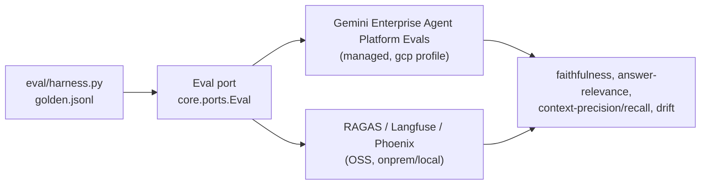

# RAG eval harness

Provider-agnostic evaluation for gcp-unlock. The SAME golden set and the SAME metric names
run against any profile (local / onprem / gcp), in-process via the `Container` or over HTTP
against a running deployment. One harness, one metric vocabulary, swappable backends.

## Files

| File | What it is |
|---|---|
| `golden.jsonl` | 12 Q/A rows over a tiny finance/HR/legal corpus. Fields: `id`, `question`, `expected_doc_substrings`, `expected_answer_keywords` |
| `harness.py` | Runner: ingests the corpus, computes the metrics, prints a table |
| `README.md` | This file |

## How to run

In-process (default). `UNLOCK_PROFILE` selects the backend; the harness builds the `Container`,
migrates + seeds, ingests the corpus through the real ingest path, then exercises the bound
`Retriever` and the shared agent loop (`core.agents.loop.run_rag_turn`).

```
python -m eval.harness                        # active UNLOCK_PROFILE (default local), k=8
UNLOCK_PROFILE=onprem python -m eval.harness    # in-process against the onprem container
python -m eval.harness --k 5                    # change the Recall@k / pool cutoff
python -m eval.harness --json                   # JSON summary on stdout (for CI)
```

HTTP (drive a live deployment). Logs in, opens a conversation, sends each question. Retrieval
internals are not exposed over HTTP, so http mode reports answer keyword-coverage, grounded rate,
and citation count; Recall@k / MRR over ranked retrieval are in-process only.

```
python -m eval.harness --http http://127.0.0.1:8000 --user alice --password alice
```

`ragas` is lazy-imported if installed (richer answer metrics); the harness runs fully without it.

## Metric glossary

The harness computes the lightweight, dependency-free subset directly. The fuller RAG metrics
below are the SAME names that a managed evaluator (Gemini Enterprise Agent Platform Evals) or an OSS evaluator
(RAGAS / Langfuse / Phoenix) computes; in this architecture they are produced behind the `Eval`
port (`core.ports.Eval.score_turn`), so the metric names are stable across backends.

| Metric | Computed here | Meaning |
|---|---|---|
| Recall@k | yes (in-process) | Did at least one of the top-k retrieved chunks come from an expected document? Measures whether the retriever surfaced the right source. |
| MRR | yes (in-process) | Mean Reciprocal Rank: 1/rank of the first correct document. Rewards ranking the right source higher. |
| Answer keyword-coverage | yes | Fraction of `expected_answer_keywords` present in the answer. A cheap faithfulness/correctness proxy with no judge model. |
| Grounded rate | yes | Fraction of answers the Validator gate marked grounded (every cited `[n]` points to a provided excerpt). |
| Faithfulness | via Eval port | Are the answer's claims supported by the retrieved context (no hallucination)? RAGAS `faithfulness`; Gemini Enterprise Agent Platform `groundedness`. |
| Answer relevance | via Eval port | Does the answer actually address the question? RAGAS `answer_relevancy`; Gemini Enterprise Agent Platform `answer_relevance`. |
| Context precision | via Eval port | Of the retrieved chunks, how many are relevant (signal vs noise in the context window)? |
| Context recall | via Eval port | Of the facts needed to answer, how many appear in the retrieved context? |
| Chunk utilization | via Eval port | Share of retrieved chunks the answer actually drew on. Low values mean over-retrieval. |
| Retrieval relevance | via Eval port | Aggregate relevance of the retrieved set to the query (retriever quality, generation-independent). |
| Drift | offline trend | Movement of any metric over time / across corpus or model versions. Flags silent regressions after a reindex or model swap. |

## Managed vs OSS, same metric names



Both back ends emit the same metric names through the `Eval` port, so a dashboard or CI gate is
written once and the backing evaluator is a profile choice, not a code change. Recall@k, MRR, and
keyword-coverage are computed directly by this harness so a profile with a no-op `Eval` still gets
a baseline retrieval + answer score.

## Notes

- The corpus is embedded in `harness.py` and ingested through the real path, so the run is
  reproducible with no external data and exercises chunking + ABAC + retrieval end to end.
- In-process retrieval runs as the admin persona (`u-alice`) so ABAC never hides a corpus doc;
  ABAC enforcement itself is covered by the app's access tests, not this harness.
